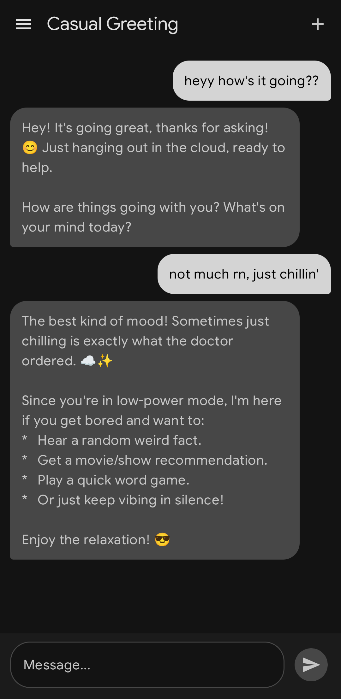
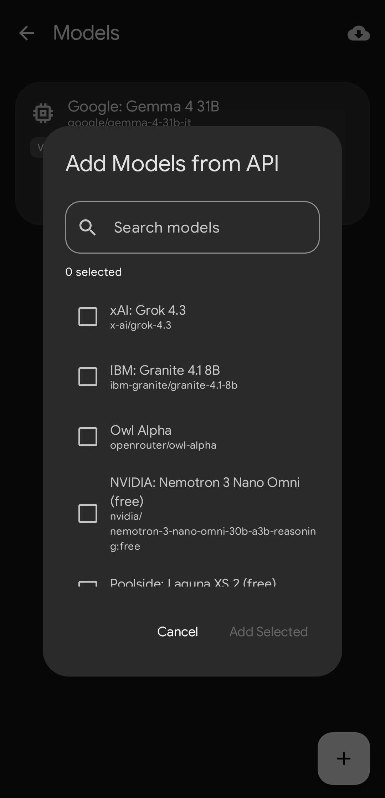

  

<h1 align="center">Relay</h1>

A modern Android AI chat client with BYOK (Bring Your Own Key) support.

  

## Features

- **BYOK Support** — Use your own API keys for OpenAI, Anthropic, Google Gemini, OpenRouter, Groq, and any custom OpenAI-compatible provider.
- **Material 3 Expressive** — Lively shapes, smooth animations, and Material You dynamic theming.
- **Multi-Provider** — Switch between AI providers seamlessly.
- **Model Management** — Fetch available models from APIs or manually configure model capabilities.
- **Streaming Responses** — Real-time token-by-token message rendering.
- **Local-First** — All chats and settings stored locally on your device.

## Tech Stack

- Kotlin + Jetpack Compose + Material 3
- MVVM Architecture with Hilt DI
- Room Database for local persistence
- Ktor Client for networking
- Kotlin Coroutines + Flow

## Building

The project uses GitHub Actions for CI/CD. Push to `main` or create a release tag to trigger an APK build.

### Download Prebuilt APKs

Grab the latest APKs from the [GitHub Actions artifacts](https://github.com/dynodevv/relay/actions) or from [Releases](https://github.com/dynodevv/relay/releases).

## Roadmap

See [ROADMAP.md](ROADMAP.md) for planned features and future development.

## Screenshots

| Chat Interface | Model Fetching |
| :---: | :---: |
|  |  |

## License

MIT
